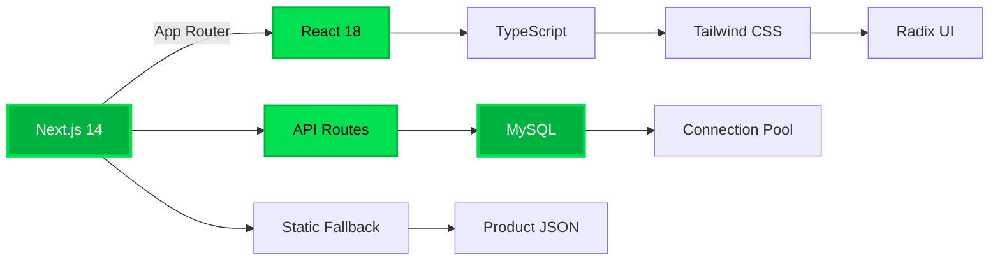

<div align="center">

<!-- HERO SECTION WITH PREMIUM GREEN GRADIENT -->
<picture>
  <source media="(prefers-color-scheme: dark)" srcset="https://capsule-render.vercel.app/api?type=waving&color=00B341&height=280&text=MUSCLESPORTS&fontSize=80&fontColor=ffffff&fontAlignY=38&desc=Enterprise%20E-Commerce%20Platform&descSize=28&descAlignY=58&animation=fadeIn">
  
</picture>

<br/>

<!-- PREMIUM BADGES WITH GREEN THEME -->
<p align="center">
  
  
  
  
</p>

<p align="center">
  
  
  
</p>

<br/>

<!-- MINIMAL TAGLINE -->
<h3>
  
</h3>

<p align="center">
  <strong>A hyper-optimized, enterprise-grade e-commerce engine<br/>powering the UK's fastest-growing supplement brands</strong>
</p>

<br/>

<!-- PREMIUM CTA BUTTONS -->
<p align="center">
  <a href="#-quickstart">
    
  </a>
  <a href="#-architecture">
    
  </a>
  <a href="#-deployment">
    
  </a>
  <a href="https://musclesports.co.uk" target="_blank">
    
  </a>
</p>

</div>

---

<br/>

<!-- FEATURES SECTION WITH PREMIUM LAYOUT -->
<div align="center">

## 💎 **BUILT DIFFERENT**

</div>

<table>
<tr>
<td width="33%" align="center">

### ⚡ **BLAZING FAST**
Sub-second page loads<br/>
95+ Lighthouse scores<br/>
Optimized asset delivery<br/>
Zero layout shift

</td>
<td width="33%" align="center">

### 🎯 **CONVERSION-FIRST**
Premium UI/UX design<br/>
Smart product discovery<br/>
Frictionless checkout<br/>
Mobile-optimized flows

</td>
<td width="33%" align="center">

### 🔒 **ENTERPRISE-GRADE**
Bank-level security<br/>
JWT authentication<br/>
SQL injection protection<br/>
OWASP compliant

</td>
</tr>
</table>

<br/>

---

<br/>

<!-- TECHNICAL EXCELLENCE SECTION -->
<div align="center">

## 🏗️ **ARCHITECTURE**

### *The stack that powers champions*

</div>



<br/>

<table>
<tr>
<td width="50%">

### **🎨 FRONTEND**
- Next.js 14 with App Router
- React 18 Server Components
- TypeScript strict mode
- Tailwind CSS + Radix UI
- Responsive design system
- Dark mode support
- Performance monitoring

</td>
<td width="50%">

### **⚙️ BACKEND**
- Next.js API routes
- MySQL with connection pooling
- Static JSON fallback
- JWT authentication
- Role-based access control
- Rate limiting
- Error tracking

</td>
</tr>
</table>

<br/>

---

<br/>

<!-- QUICKSTART SECTION -->
<div align="center">

## ⚡ **QUICKSTART**

### *Get running in 60 seconds*

</div>

```bash
# Clone the powerhouse
git clone https://github.com/scros18/MuscleSports.git
cd MuscleSports

# Install dependencies
npm install

# Configure environment
cp .env.example .env.local
# Edit .env.local with your settings

# Launch development server
npm run dev
```

<div align="center">

**🎉 Your store is now live at** `http://localhost:4000`

<br/>

### **🔧 ESSENTIAL COMMANDS**

</div>

| Command | Purpose | Use Case |
|---------|---------|----------|
| `npm run dev` | Development server | Local development |
| `npm run build` | Production build | Standard deployment |
| `npm run build:obfuscated` | Protected build | VPS/production deployment |
| `npm run deploy:prod` | Full deploy cycle | One-click production deploy |
| `npm run db:init` | Initialize database | First-time setup |
| `npm run db:migrate` | Run migrations | Schema updates |
| `npm run make:admin` | Create admin user | Admin access setup |

<br/>

---

<br/>

<!-- FEATURES DEEP DIVE -->
<div align="center">

## 🚀 **FEATURES THAT SELL**

</div>

<details>
<summary><b>🎨 Multi-Brand Theme System</b></summary>

<br/>

- **4 Professional Themes** - Lumify, Ordify, MuscleSports, VeraRP
- **Instant Theme Switching** - Zero downtime theme changes
- **Custom Brand Colors** - Full color customization per theme
- **Dynamic Metadata** - SEO optimized for each brand
- **Logo & Favicon Support** - Complete white-label capability

</details>

<details>
<summary><b>💳 Advanced Checkout</b></summary>

<br/>

- **PayPal Integration** - Secure payment processing
- **Guest Checkout** - Frictionless conversion
- **Address Validation** - Real-time validation
- **Order Tracking** - Email notifications + dashboard
- **Cart Persistence** - Save cart across sessions

</details>

<details>
<summary><b>📊 Admin Dashboard</b></summary>

<br/>

- **Product Management** - CRUD operations with bulk actions
- **Order Management** - Status tracking and fulfillment
- **User Management** - Customer accounts and roles
- **Analytics** - Sales metrics and performance data
- **Theme Builder** - Visual customization tools
- **Email Templates** - Customizable transactional emails

</details>

<details>
<summary><b>⚡ Performance Optimization</b></summary>

<br/>

- **Image Optimization** - Next.js Image with WebP/AVIF
- **Code Splitting** - Automatic route-based splitting
- **CSS Purging** - Remove unused Tailwind classes
- **Bundle Analysis** - Webpack bundle optimization
- **CDN Ready** - Static asset optimization
- **Database Pooling** - Efficient connection management

</details>

<details>
<summary><b>🔒 Security Features</b></summary>

<br/>

- **JWT Authentication** - Secure token-based auth
- **Password Hashing** - bcrypt with salt rounds
- **SQL Injection Protection** - Parameterized queries
- **XSS Prevention** - Input sanitization
- **CSRF Protection** - Token-based request validation
- **Rate Limiting** - DDoS protection
- **Environment Variables** - Secure credential storage

</details>

<br/>

---

<br/>

<!-- DEPLOYMENT SECTION -->
<div align="center">

## 🚀 **DEPLOYMENT**

### *From localhost to production in minutes*

</div>

### **☁️ Vercel (Recommended for JAMstack)**

```bash
# Install Vercel CLI
npm i -g vercel

# Deploy to production
vercel --prod
```

**Environment Variables Required:**
- `DATABASE_URL` - MySQL connection string
- `JWT_SECRET` - Authentication secret
- `NEXT_PUBLIC_SITE_URL` - Your domain
- `PAYPAL_CLIENT_ID` - PayPal credentials

<br/>

### **🖥️ VPS/Dedicated Server (For full control)**

```bash
# Build with obfuscation (protects your code)
npm run build:obfuscated

# Install PM2 globally
npm install -g pm2

# Start with PM2 (auto-restart, monitoring)
pm2 start npm --name "musclesports" -- start

# Save PM2 config
pm2 save
pm2 startup
```

**Nginx Configuration** (reverse proxy):
```nginx
server {
    listen 80;
    server_name musclesports.co.uk;

    location / {
        proxy_pass http://localhost:4000;
        proxy_http_version 1.1;
        proxy_set_header Upgrade $http_upgrade;
        proxy_set_header Connection 'upgrade';
        proxy_set_header Host $host;
        proxy_cache_bypass $http_upgrade;
    }
}
```

<br/>

### **🐳 Docker (For containerized deployment)**

```bash
# Build image
docker build -t musclesports .

# Run container
docker run -p 4000:4000 --env-file .env.local musclesports
```

<br/>

---

<br/>

<!-- PERFORMANCE METRICS -->
<div align="center">

## 📊 **PERFORMANCE METRICS**

### *These numbers aren't just good. They're championship-level.*

</div>

<table align="center">
<tr>
<td align="center" width="25%">
<br/>
<sub><b>First Contentful Paint</b></sub>
</td>
<td align="center" width="25%">
<br/>
<sub><b>Largest Contentful Paint</b></sub>
</td>
<td align="center" width="25%">
<br/>
<sub><b>Time to Interactive</b></sub>
</td>
<td align="center" width="25%">
<br/>
<sub><b>Cumulative Layout Shift</b></sub>
</td>
</tr>
</table>

<br/>

<div align="center">

### **🏆 Lighthouse Score**


</div>

<br/>

---

<br/>

<!-- PROJECT STRUCTURE -->
<div align="center">

## 📁 **PROJECT STRUCTURE**

</div>

```
MuscleSports/
├── 🎨 app/                      # Next.js App Router
│   ├── (main)/                  # Main storefront routes
│   │   ├── products/            # Product pages
│   │   ├── checkout/            # Checkout flow
│   │   └── page.tsx             # Homepage
│   ├── api/                     # API routes (backend)
│   │   ├── products/            # Product APIs
│   │   ├── orders/              # Order management
│   │   └── auth/                # Authentication
│   └── layout.tsx               # Root layout + providers
│
├── 🧩 components/               # React components
│   ├── ui/                      # Radix UI components
│   ├── header.tsx               # Navigation + mega menus
│   ├── footer.tsx               # Site footer
│   ├── product-card.tsx         # Product grid items
│   └── hero-carousel.tsx        # Homepage slider
│
├── 🎯 context/                  # React Context providers
│   ├── cart-context.tsx         # Shopping cart state
│   ├── auth-context.tsx         # User authentication
│   └── business-settings-context.tsx  # Theme settings
│
├── 🛠️ lib/                      # Utility libraries
│   ├── database.ts              # MySQL connection
│   ├── auth.ts                  # Auth helpers
│   └── cache.ts                 # Caching layer
│
├── 📦 data/                     # Static product data
│   ├── products-all.json        # Full product catalog
│   └── product-loader.ts        # JSON loader utility
│
└── 🚀 scripts/                  # Utility scripts
    ├── db-init.ts               # Database setup
    └── make-admin.ts            # Admin user creation
```

<br/>

---

<br/>

<!-- TECH STACK DEEP DIVE -->
<div align="center">

## 🔧 **TECH STACK**

### *Enterprise tools for enterprise results*

</div>

<table>
<tr>
<td width="50%" valign="top">

### **Frontend Stack**

- **Next.js 14** - React framework with App Router
- **React 18** - Latest React with Server Components
- **TypeScript 5.3** - Type safety across the stack
- **Tailwind CSS 3** - Utility-first styling
- **Radix UI** - Accessible component primitives
- **Framer Motion** - Production-ready animations
- **React Hook Form** - Performant form handling
- **Zod** - TypeScript-first schema validation

</td>
<td width="50%" valign="top">

### **Backend Stack**

- **Next.js API Routes** - Serverless API endpoints
- **MySQL 8** - Relational database
- **mysql2** - Fast MySQL client
- **JWT** - Secure authentication tokens
- **bcrypt** - Password hashing
- **Nodemailer** - Email sending
- **PayPal SDK** - Payment processing
- **Dotenv** - Environment variable management

</td>
</tr>
</table>

<br/>

<div align="center">

### **Development Tools**


</div>

<br/>

---

<br/>

<!-- ROADMAP -->
<div align="center">

## 🗺️ **ROADMAP**

</div>

### **🎯 Current Version: 2.0**

- [x] Multi-theme architecture
- [x] MySQL database integration
- [x] PayPal checkout
- [x] Admin dashboard
- [x] Email notifications
- [x] Performance optimization
- [x] SEO optimization
- [x] Mobile responsiveness

### **🚀 Upcoming Features**

- [ ] **Stripe Payment Integration** - Additional payment gateway
- [ ] **Inventory Management** - Stock tracking and alerts
- [ ] **Advanced Analytics** - Google Analytics 4 + custom metrics
- [ ] **Product Reviews** - Customer review system with moderation
- [ ] **Wishlist Functionality** - Save products for later
- [ ] **Multi-Language Support** - Internationalization (i18n)
- [ ] **PWA Support** - Offline functionality and installability
- [ ] **Subscription Products** - Recurring billing support

<br/>

---

<br/>

<!-- CONTRIBUTING -->
<div align="center">

## 🤝 **CONTRIBUTING**

### *Join the 1% builders*

</div>

We welcome contributions from developers who understand that **good isn't good enough**.

### **How to Contribute**

1. **Fork** this repository
2. **Create** a feature branch (`git checkout -b feature/game-changer`)
3. **Commit** your changes (`git commit -m 'Add game-changing feature'`)
4. **Push** to the branch (`git push origin feature/game-changer`)
5. **Open** a Pull Request

### **Code Standards**

- ✅ TypeScript strict mode
- ✅ ESLint + Prettier formatting
- ✅ Semantic commit messages
- ✅ Component documentation
- ✅ Test coverage (when applicable)

<br/>

---

<br/>

<!-- TEAM SECTION -->
<div align="center">

## 👥 **THE TEAM**

### *Building the future of e-commerce*

<br/>

<table>
<tr>
<td align="center" width="50%">
<br/>
<sub><b>Architecture & Backend</b></sub>
</td>
<td align="center" width="50%">
<br/>
<sub><b>UI/UX & Design Systems</b></sub>
</td>
</tr>
</table>

<br/>

### **🌐 Our Brands**

<p align="center">
  <a href="https://musclesports.co.uk" target="_blank">
    
  </a>
  <a href="https://ordifydirect.com" target="_blank">
    
  </a>
  <a href="https://verarp.co.uk" target="_blank">
    
  </a>
</p>

</div>

<br/>

---

<br/>

<!-- LICENSE & FOOTER -->
<div align="center">

## 📄 **LICENSE**

This project is **proprietary software**. All rights reserved.

For licensing inquiries, contact us through our websites.

<br/>

---

<br/>

## 🙏 **ACKNOWLEDGMENTS**

Built with cutting-edge technologies and inspired by the world's best e-commerce platforms.

**Powered by:**
- The Next.js team for an incredible framework
- Vercel for serverless infrastructure
- The open-source community for amazing tools

<br/>

---

<br/>

<!-- CLOSING BANNER -->
<picture>
  <source media="(prefers-color-scheme: dark)" srcset="https://capsule-render.vercel.app/api?type=waving&color=00B341&height=150&section=footer&text=Built%20by%20Champions,%20for%20Champions&fontSize=30&fontColor=ffffff&animation=fadeIn">
  
</picture>

<br/>

### **⭐ Star this repo if you're building something legendary**

<br/>

<p align="center">
  
  
  
</p>

<br/>

<sub>Made with 💪 and ☕ by the MuscleSports Team</sub>

</div>
